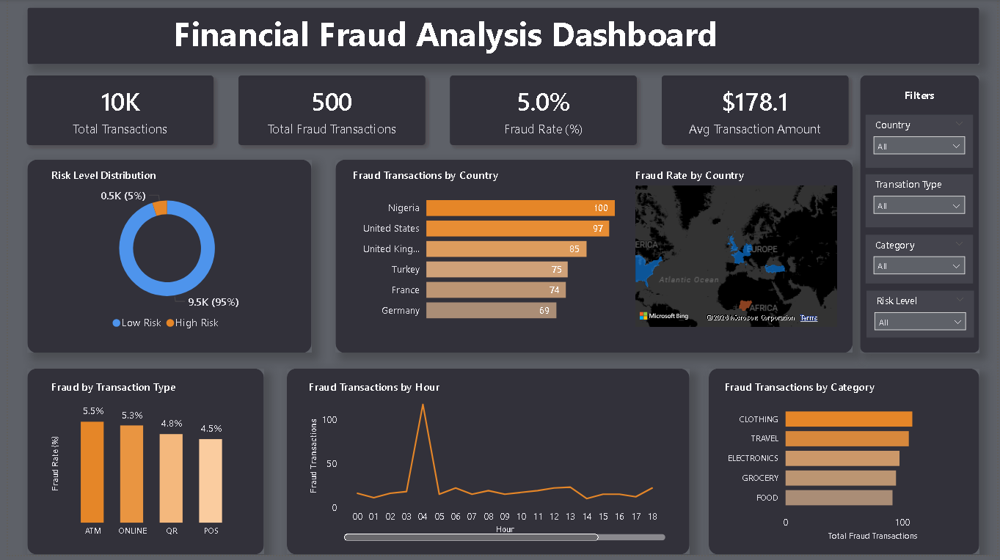

# 📊 Financial Fraud Analysis – SQL & Power BI

## Project Overview
This project analyzes financial transaction data to identify fraud patterns and risk behavior.  
The work includes **exploratory data analysis (EDA)** and **data cleaning using SQL (MS SQL Server)**, followed by an **interactive Power BI dashboard**.

---

## Dashboard Preview

---

### Dashboard File
📥 **[Download Power BI Dashboard](Fraud%20analysis%20dashboard.pbix)**

## Dataset
Synthetic financial fraud dataset containing transaction details such as amount, transaction type, merchant category, country, time, risk scores, and fraud status.

---

## Exploratory Data Analysis (EDA)
EDA was performed using SQL Server to understand data quality and behavior before cleaning:

- Reviewed sample records and dataset size  
- Checked column structure and data types  
- Identified missing values and duplicate transaction IDs  
- Validated numeric fields (transaction amount and hour)  
- Analyzed transaction distributions by:
  - Transaction type  
  - Merchant category  
  - Country  
  - Hour of the day  
- Calculated overall fraud distribution  
- Created risk buckets (Low, Medium, High) using device and IP risk scores  
- Analyzed fraud occurrence across risk levels  

---

## Data Cleaning & Transformation
Data was cleaned and transformed using SQL to make it analytics-ready:

- Removed invalid transactions (amount ≤ 0)  
- Ensured valid transaction hours (0–23)  
- Standardized categorical text fields  
- Converted country codes to full country names  
- Created a clean table for analysis  
- Derived a new `risk_level` column based on risk scores  

The cleaned dataset was then used in Power BI.

---

## Power BI Dashboard
The dashboard provides insights into fraud behavior through:

- Key metrics: total transactions, fraud count, fraud rate  
- Fraud analysis by country, transaction type, and merchant category  
- Risk level distribution and fraud comparison  
- Hourly fraud trends  
- Interactive filters for deeper analysis  

---

## Tools & Technologies
- SQL Server (MS SQL)  
- Power BI  
- Excel  
- GitHub  

---

## Author
**Asna Sharin PV (Aachi)**  
Aspiring Data Analyst  

- LinkedIn: http://linkedin.com/in/asna-sharin-b3757025a  
- Portfolio: https://asnasharinpv.netlify.app
